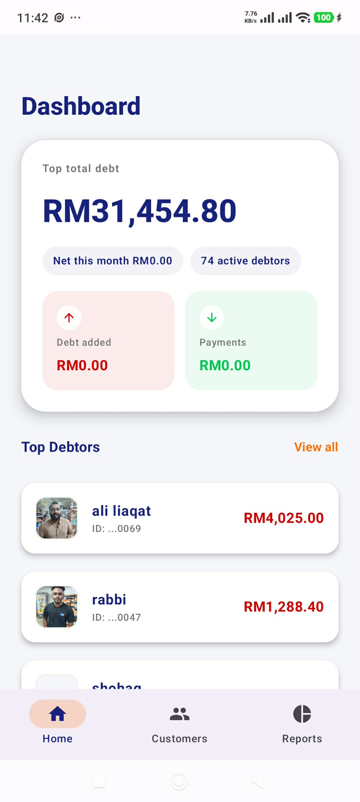
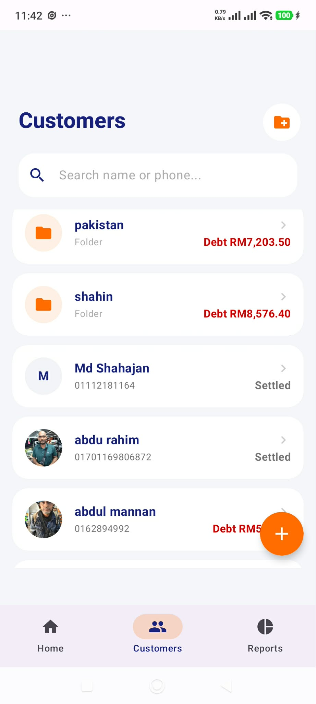
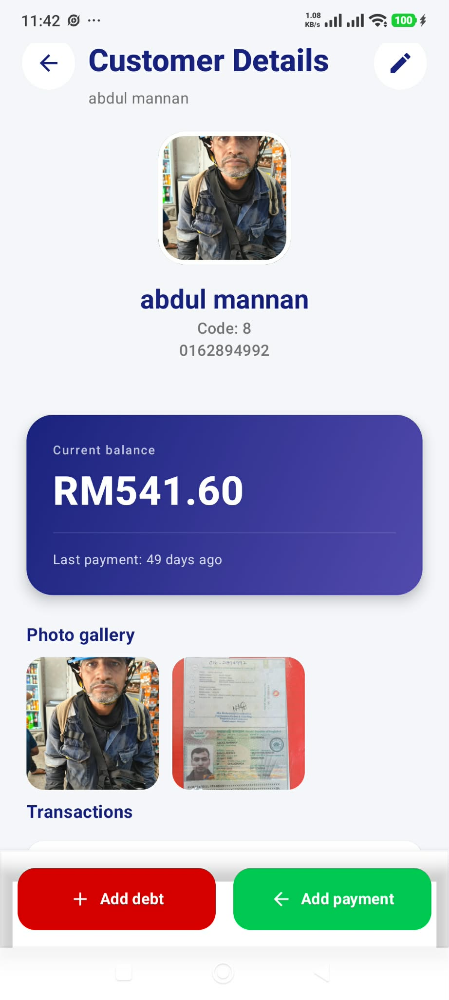
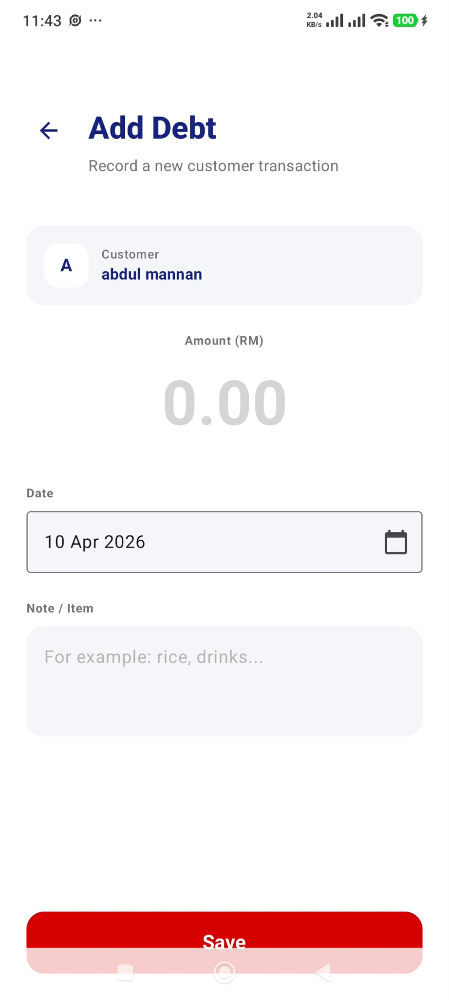
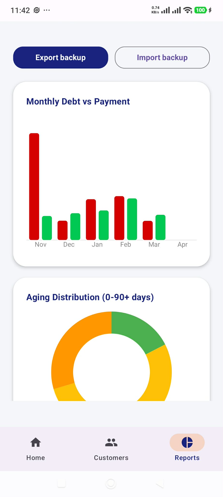
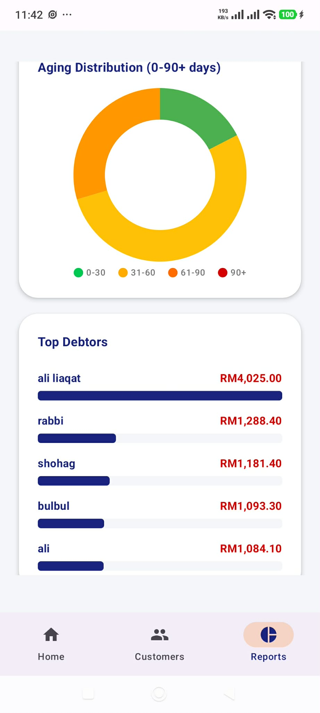

# Noteds

A local-first Android app for managing customer debts — built for a real grocery store where customers regularly buy on credit and pay later.

---

## The Problem

My parents run a grocery store where many customers buy on credit. Tracking who owed what, how much had been paid back, and when to follow up was previously done on paper. Records could be lost, balances could become inaccurate, and there was no easy way to get a clear overall view.

I built Noteds to replace that workflow with something more reliable, faster to use, and always available — even without internet.

## How It Works

Add a customer → record debts and payments → see balances update in real time → review reports and trends on the dashboard.

The app is built around one core idea: **every ringgit in and out is tracked as a ledger entry**, and everything else — balances, reports, aging analysis, and summary stats — is derived automatically from that ledger.

## UI / UX Approach

Noteds is a functional business tool, so the UI was designed to be **simple, clear, and easy to use in daily store operations**.

Instead of focusing on decorative visuals, the app prioritizes:

* **Fast data entry** for debts and payments
* **Clear information hierarchy** so balances and customer status are easy to understand at a glance
* **Minimal friction** for users who may not be highly technical
* **Clean and consistent screens** to reduce confusion during repeated daily use

The overall design uses a straightforward, uncluttered style because this app is meant to support work efficiently, not distract from it.

## Screenshots

| Dashboard                   | Customers                   |
| --------------------------- | --------------------------- |
|  |  |

| Customer Detail                | Add Debt                 |
| ------------------------------ | ------------------------ |
|  |  |

| Reports — Charts               | Reports — Aging & Top Debtors   |
| ------------------------------ | ------------------------------- |
|  |  |

## Data Architecture

The app uses two main entities:

**CustomerEntity** stores customer information such as name, phone number, photos, and ID documents. It also doubles as a folder node for organizing customers into groups. A single `isGroup` flag and `parentId` field allow the same table to behave like a tree structure.

**LedgerEntryEntity** records every debt and payment as a single row with a type (`DEBT` or `PAYMENT`), amount, timestamp, and note. Balances are never stored directly — they are always calculated from the sum of ledger entries.

```text
Customer (isGroup=false)
  └── LedgerEntry (DEBT, RM 500)
  └── LedgerEntry (PAYMENT, RM 200)
  └── Balance = RM 300 (calculated, not stored)

Folder (isGroup=true, parentId=null)
  └── Customer A (parentId=folder.id)
  └── Customer B (parentId=folder.id)
  └── Folder balance = sum of all children (calculated recursively)
```

## Data Flow

```text
User adds customer / records transaction
  → ViewModel validates input
  → Photos copied to app private directory
  → Repository → DAO → Room (SQLite)
  → Room emits new data via Flow
  → ViewModel recalculates balances, stats, and reports
  → Compose UI collects StateFlow and re-renders
```

Everything is reactive. When a payment is recorded, the customer balance, dashboard totals, reports, and aging statistics update automatically through Kotlin Flow.

## Performance Considerations

Because this app is used in a real store environment, performance and responsiveness were important design goals.

Some of the implementation choices were made with this in mind:

* **Local-first storage with Room** avoids network delay during daily use
* **Reactive updates with Flow** keep the UI in sync without manual refreshes
* **Derived balances instead of manual edits** reduce inconsistency and simplify recalculation logic
* **Simple UI structure** helps keep interactions fast and predictable
* **Photo handling inside app-private storage** keeps related customer data organized and easier to manage safely

The goal was not only to make the app functional, but also practical to use repeatedly throughout the day.

## Why Local-First, No Cloud

This was a deliberate choice, not a limitation:

* **No internet required** — the store’s connection is unreliable
* **No server cost** — this is a personal tool, not a SaaS product
* **Full data ownership** — customer financial data stays on the device
* **Simpler architecture** — no sync conflicts, no authentication system, and no API layer

The tradeoff is that multi-device sync is not built in. However, backup and restore were designed to make phone switching and manual import/export much easier when needed.

## Backup & Restore

Backup is not just a database dump. The app exports a zip package containing:

* `data.json` — all active customers and ledger entries
* `photos/` — all customer and ID photos

The backup and restore flow was designed carefully because losing customer payment history would be unacceptable in real usage. It also helps make switching devices or restoring data after a problem much easier.

Restore uses a staged approach:

1. Extract the zip into a temporary directory
2. Place photos into a `staged_customer_photos` folder first, not directly into production storage
3. Back up current photos into `existing_customer_photos_backup`
4. Replace the database in a single Room transaction (`delete all → insert all`)
5. If anything fails, restore photos from the backup copy
6. Let the database transaction roll back automatically on failure

This makes restore close to atomic — it either succeeds fully or reverts safely.

## Folder / Group System

Instead of maintaining a separate folders table, folders are modeled using the same `CustomerEntity` table with `isGroup = true`. This keeps the schema simpler while still supporting hierarchical organization.

* Root level: `parentId IS NULL`
* Inside a folder: `parentId = folder.id`
* Folder balances: recursively aggregated from all children in memory
* Moving a customer into one of its own descendants is blocked to prevent circular references
* Deleting a folder recursively deletes all children, their ledger entries, and their photos

## Tech Stack

| Layer         | Tech                         |
| ------------- | ---------------------------- |
| Language      | Kotlin                       |
| UI            | Jetpack Compose + Material 3 |
| Database      | Room (SQLite)                |
| Async         | Coroutines + Flow            |
| Image Loading | Coil                         |
| Serialization | Gson                         |
| Build         | Gradle + KSP                 |

## Features

* Customer management with photos and ID documents
* Folder/group hierarchy for organizing customers
* Debt and payment ledger with full transaction history
* Real-time balance calculation from ledger entries
* Dashboard with total outstanding amount, top debtors, and monthly summaries
* Reports with monthly debt vs payment trends, aging distribution, and average collection period
* Zip backup with photos and staged restore with rollback support
* Soft delete for safer data removal
* Chinese / English language toggle
* Expected repayment date tracking

## Run Locally

```bash
git clone https://github.com/Noyolos/Noteds.git
cd Noteds
```

Open the project in Android Studio, then build and run it on an emulator or Android device.

* Minimum SDK: 26

## Project Status

Working v1, actively used in a real grocery store.

Known areas for future improvement:

* Consolidate legacy JSON backup code with the newer zip-based backup flow
* Migrate hardcoded UI strings into proper `strings.xml` resources
* Consider splitting the shared Customer/Folder table if the data model becomes more complex
* Optimize recursive folder balance calculation for larger datasets
* Improve scalability for stores with larger customer lists and transaction volumes

## Real Usage

Noteds was built for my parents’ grocery store and is used to track real customer debts and repayments in daily operations.

That real usage shaped many of the design decisions:

* The UI had to be easy to understand and quick to use
* The app had to work reliably without internet
* Performance had to stay practical for repeated daily actions
* Backup and restore had to be treated seriously because even a single lost payment record would matter

This project was not built as a demo first — it was built to solve a real operational problem, and the current version is already being used in practice.
